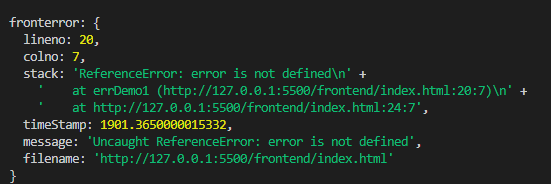

# 前端异常监控

日常开发中debugger是最频繁的工作，大部分时间都花在修改缺陷上面，很多错误都不是一下子就能解决，特别是一些线上压缩代码，调试通常都需要本地代理到线上进行联调，那如果能监控前端异常，还原错误是不是可以快速定位问题呢。

### 前端错误收集

#### js异常

同步的错误会阻塞进程，很容易就能察觉，但异步的报错，如果不涉及到其中的交互，通常都毫无察觉，打开F12才能发觉。

```JavaScript
setTimeout(() => {
    console.log('1->begin')
    error
    console.log('1->end')
})
setTimeout(() => {
    console.log('2->begin')
    console.log('2->end')
})
```


上面的例子我们用setTimeout分别启动了两个任务，虽然第一个任务执行了一个错误的方法。程序执行停止了。但是另外一个任务并没有收到影响。

其实如果你不打开控制台都看不到发生了错误。好像是错误是在静默中发生的。

下面我们来看看这样的错误该如何收集。

##### try-catch

我们首先想到的就是通过try-catch来收集。

```javascript
setTimeout(() => {
  try {
    console.log('1->begin')
    error
    console.log('1->end')
  } catch (e) {
    console.log('catch',e)
  }
})
```


 如果在函数中错误没有被捕获，错误会上抛。 

```javascript
function fun1() {
  console.log('1->begin')
  error
  console.log('1->end')
}
setTimeout(() => {
  try {
    fun1()
  } catch (e) {
    console.log('catch',e)
  }
})
```


 控制台中打印出的分别是错误信息和错误堆栈。 

 读到这里大家可能会想那就在最底层做一个错误try-catch不就好了吗 , 但是理想很丰满，现实很骨感。我们看看下一个例子 。

```javascript
function fun1() {
  console.log('1->begin')
  error
  console.log('1->end')
}

try {
  setTimeout(() => {
    fun1()

  })
} catch (e) {
  console.log('catch', e)
}
```


 大家注意运行结果，异常并没有被捕获。 

 这是因为JS的try-catch功能非常有限一遇到异步就不好用了。那总不能为了收集错误给所有的异步都加一个try-catch吧 。

##### window.onerror

 window.onerror 最大的好处就是可以同步任务还是异步任务都可捕获。 

```javascript
function fun1() {
  console.log('1->begin')
  error
  console.log('1->end')
}
window.onerror = (...args) => {
  console.log('onerror:',args)
}

setTimeout(() => {
  fun1()
})
```


 onerror还有一个问题大家要注意 如果返回true 就不会被上抛了。不然控制台中还会看到错误日志。 

```
function fun1() {
  console.log('1->begin')
  error
  console.log('1->end')
}
window.onerror = (...args) => {
  console.log('onerror:',args)
  return true
}

setTimeout(() => {
  fun1()
})
```


##### 监听error事件

> window.addEventListener('error',() => {}） 

 其实onerror固然好但是还是有一类异常无法捕获。这就是网络异常的错误。比如下面的例子。 

```

```

 试想一下我们如果页面上要显示的图片突然不显示了，而我们浑然不知那就是麻烦了。 

```javascript
window.addEventListener('error', args => {
    console.log(
      'error event:', args
    );
    return true;
  }, 
  true // 利用捕获方式
);
```


##### Promise异常捕获

 Promise的出现主要是为了让我们解决回调地域问题。基本是我们程序开发的标配了。 

```javascript
new Promise((resolve, reject) => {
  abcxxx()
});
```

 这种情况无论是onerror还是监听错误事件都是无法捕获的 。

 ```javascript
new Promise((resolve, reject) => {
  error()
})
// 增加异常捕获
  .catch((err) => {
  console.log('promise catch:',err)
});
 ```

 除非每个Promise都添加一个catch方法。但是显然是不能这样做。 

```javascript
window.addEventListener("unhandledrejection", e => {
  console.log('unhandledrejection',e)
});
```


 我们可以考虑将unhandledrejection事件捕获错误抛出交由错误事件统一处理就可以了 。

```javascript
window.addEventListener("unhandledrejection", e => {
  throw e.reason
});
```

##### async/await异常捕获

```javascript
const asyncFunc = () => new Promise(resolve => {
  error
})
setTimeout(async() => {
  try {
    await asyncFun()
  } catch (e) {
    console.log('catch:',e)
  }
})
```

 实际上async/await语法本质还是Promise语法。区别就是async方法可以被上层的try/catch捕获。 


 如果不去捕获的话就会和Promise一样，需要用unhandledrejection事件捕获。这样的话我们只需要在全局增加unhandlerejection就好了。 


##### 小结

| 异常类型                   | 同步方法 | 异步方法 | 资源加载 | Promise | async/await |
| -------------------------- | -------- | -------- | -------- | ------- | ----------- |
| try/catch                  | √        |          |          |         | √           |
| onerror                    | √        | √        |          |         |             |
| error事件监听              | √        | √        | √        |         |             |
| unhandledrejection事件监听 |          |          |          | √       | √           |

 实际上我们可以将unhandledrejection事件抛出的异常再次抛出就可以统一通过error事件进行处理了。 

 最终用代码表示如下： 

```javascript
window.addEventListener("unhandledrejection", e => {
  throw e.reason
});
window.addEventListener('error', args => {
  console.log(
    'error event:', args
  );
  return true;
}, true);
```

#### webpack工程化

 现在是前端工程化的时代,工程化导出的代码一般都是被压缩混淆后的。 

比如：

```javascript
setTimeout(() => {
    xxx(1223)
}, 1000)
```


 出错的代码指向被压缩后的JS文件，而JS文件长下图这个样子。 


 如果想将错误和原有的代码关联起来就需要sourcemap文件的帮忙了。 

##### sourceMap是什么

简单说，`sourceMap`就是一个文件，里面储存着位置信息。

仔细点说，这个文件里保存的，是转换后代码的位置，和对应的转换前的位置。

那么如何利用sourceMap对还原异常代码发生的位置这个问题我们到异常分析这个章节再讲。

具体怎么在webpack配置sourcemap，以及sourcemap有哪些格式，可以参考[这篇文章](https://blog.csdn.net/DengZY926/article/details/106123735)。

#### Vue错误收集

 为了测试的需要我们暂时关闭eslint 这里面还是建议大家全程打开eslint 

 在vue.config.js进行配置 

```javascript
module.exports = {   
  // 关闭eslint规则
  devServer: {
    overlay: {
      warnings: true,
      errors: true
    }
  },
  lintOnSave:false
}
```

 我们故意在src/components/HelloWorld.vue 

```
<script>
export default {
  name: "HelloWorld",
  props: {
    msg: String
  },
  mounted() {
    // 制造一个错误
    abc()
  }
};
</script>
​```html

然后在src/main.js中添加错误事件监听

​```js
window.addEventListener('error', args => {
  console.log('error', error)
})
```

 这个时候 错误会在控制台中被打印出来,但是错误事件并没有监听到。 


##### handleError

 为了对Vue发生的异常进行统一的上报，需要利用vue提供的handleError句柄。一旦Vue发生异常都会调用这个方法。 

 我们在src/main.js 

```vue
Vue.config.errorHandler = function (err, vm, info) {
  console.log('errorHandle:', err)
}
```

 运行结果结果： 


#### vue3.0

新建vue3.0模板的工程，发现不用通过handleError句柄，直接通过error事件监听。


### 错误上报

#### 上报方式

##### 动态创建img标签

 上报就是要将捕获的异常信息发送到后端。最常用的方式首推动态创建标签方式。因为这种方式无需加载任何通讯库，而且页面是无需刷新的。基本上目前包括百度统计 Google统计都是基于这个原理做的埋点。 

```javascript
new Image().src = 'http://localhost:7001/monitor/error'+ '?info=xxxxxx'
```


 通过动态创建一个img标签,浏览器就会向服务器发送get请求。可以把你需要上报的错误数据放在querystring字符串中，利用这种方式就可以将错误上报到服务器了。 

##### Ajax上报

 实际上我们也可以用ajax的方式上报错误，这和我们再业务程序中并没有什么区别。在这里就不赘述。 

#### 上报哪些数据


我们来看下error事件参数：

| 属性名称      | 含义          | 类型   |
| ------------- | ------------- | ------ |
| message       | 错误信息      | string |
| filename      | 异常的资源url | string |
| lineno        | 异常行号      | int    |
| colno         | 异常列号      | int    |
| error         | 错误对象      | object |
| error.message | 错误信息      | string |
| error.stack   | 错误堆栈      | string |

其中核心的应该是错误栈，其实我们定位错误最主要的就是错误栈。

错误堆栈中包含了绝大多数调试有关的信息。其中包括了异常位置（行号，列号），异常信息。

#### 上报数据序列化

 由于通讯的时候只能以字符串方式传输，我们需要将对象进行序列化处理。 

大概分成以下三步：

- 将异常数据从属性中解构出来存入一个JSON对象
- 将JSON对象转换为字符串
- 将字符串转换为Base64

后面后端也要做对应的反向操作。

```javascript
window.addEventListener('error', args => {
  console.log(
    'error event:', args
  );
  uploadError(args)
  return true;
}, true);
function uploadError({
    lineno,
    colno,
    error: {
      stack
    },
    timeStamp,
    message,
    filename
  }) {
    // 过滤
    const info = {
      lineno,
      colno,
      stack,
      timeStamp,
      message,
      filename
    }
  	const str = window.btoa(JSON.stringify(info))
    const host = 'http://localhost:7001/monitor/error'
    new Image().src = `${host}?info=${str}`
```

#### 异常收集

 异常上报的数据一定是要有一个后端服务接收才可以。 

我们使用eggjs来进行演示

##### 编写error上传接口

 首先在app/router.js添加一个新的路由 

```javascript
module.exports = app => {
  const { router, controller } = app;
  router.get('/', controller.home.index);
  // 创建一个新的路由
  router.get('/monitor/error', controller.monitor.index);
};
```

 创建一个新的controller (app/controller/monitor) 

```javascript
'use strict';

const Controller = require('egg').Controller;

class MonitorController extends Controller {
  async index() {
    const { ctx } = this;
    const { info } = ctx.query
    const json = JSON.parse(Buffer.from(info, 'base64').toString('utf-8'))
    console.log('fronterror:', json)
    ctx.body = '';
  }
}

module.exports = MonitorController;
```

接收到的错误信息：



##### 记入日志文件

 下一步就是讲错误记入日志。实现的方法可以自己用fs写，也可以借助log4js这样成熟的日志库。 

 当然在eggjs中是支持我们定制日志那么我么你就用这个功能定制一个前端错误日志好了。 

 在/config/config.default.js中增加一个定制日志配置 

```javascript
// 定义前端错误日志
config.customLogger = {
  frontendLogger : {
    file: path.join(appInfo.root, 'logs/frontend.log')
  }
}
```

 在/app/controller/monitor.js中添加日志记录 

```javascript
async index() {
    const { ctx } = this;
    const { info } = ctx.query
    const json = JSON.parse(Buffer.from(info, 'base64').toString('utf-8'))
    console.log('fronterror:', json)
    // 记入错误日志
    this.ctx.getLogger('frontendLogger').error(json)
    ctx.body = '';
  }
```

最后实现的效果：


### 异常分析

 谈到异常分析最重要的工作其实是将webpack混淆压缩的代码还原。 

#### Webpack插件实现SourceMap上传

在webpack的打包时会产生sourcemap文件，这个文件需要上传到异常监控服务器。这个功能我们试用webpack插件完成。

##### 创建webpack插件

```javascript
const fs = require('fs')
var http = require('http');

class UploadSourceMapWebpackPlugin {
  constructor(options) {
    this.options = options
  }

  apply(compiler) {
    // 打包结束后执行
    compiler.hooks.done.tap("upload-sourcemap-plugin", status => {
      console.log('webpack runing')
    });
  }
}

module.exports = UploadSourceMapWebpackPlugin;
```

##### 加载webpack插件

```javascript
// webpack.config.js
// 自动上传Map
UploadSourceMapWebpackPlugin = require('./plugin/uploadSourceMapWebPackPlugin')

plugins: [
    // 添加自动上传插件
    new UploadSourceMapWebpackPlugin({
      uploadUrl:'http://localhost:7001/monitor/sourcemap',
      apiKey: 'kaikeba'
    })
  ]
```

##### 添加读取sourcemap读取逻辑

在apply函数中增加读取sourcemap文件的逻辑

```javascript
// /plugin/uploadSourceMapWebPlugin.js
const glob = require('glob')
const path = require('path')
apply(compiler) {
  // 定义在打包后执行
  compiler.hooks.done.tap('upload-sourecemap-plugin', async status => {
    // 读取sourcemap文件
    const list = glob.sync(path.join(status.compilation.outputOptions.path, `./**/*.{js.map,}`))
    for (let filename of list) {
      await this.upload(this.options.uploadUrl, filename)
    }
  })
}
```

##### 实现http上传功能

```javascript
upload(url, file) {
  return new Promise(resolve => {
    const req = http.request(
      `${url}?name=${path.basename(file)}`,
      {
        method: 'POST',
        headers: {
          'Content-Type': 'application/octet-stream',
          Connection: "keep-alive",
          "Transfer-Encoding": "chunked"
        }
      }
    )
    fs.createReadStream(file)
      .on("data", chunk => {
      req.write(chunk);
    })
      .on("end", () => {
      req.end();
      resolve()
    });
  })
}
```

##### 服务器端添加上传接口

```javascript
// /backend/app/router.js
module.exports = app => {
  const { router, controller } = app;
  router.get('/', controller.home.index);
  router.get('/monitor/error', controller.monitor.index);
  // 添加上传路由
 router.post('/monitor/sourcemap',controller.monitor.upload)
};
```

添加sourcemap上传接口

```javascript
// /backend/app/controller/monitor.js
async upload() {
    const { ctx } = this
    const stream = ctx.req
    const filename = ctx.query.name
    const dir = path.join(this.config.baseDir, 'uploads')
    // 判断upload目录是否存在
    if (!fs.existsSync(dir)) {
      fs.mkdirSync(dir)
    }

    const target = path.join(dir, filename)
    const writeStream = fs.createWriteStream(target)
    stream.pipe(writeStream)
}
```

最终效果：

执行webpack打包时调用插件sourcemap被上传至服务器。


#### 解析ErrorStack

先看一下我们的需求

| 输入 | stack(错误栈) | ReferenceError: xxx is not defined\n' + ' at http://localhost:7001/public/bundle.e7877aa7bc4f04f5c33b.js:1:1392' |
| ---- | ------------- | ------------------------------------------------------------ |
|      | SourceMap     | 略                                                           |
| 输出 | 源码错误栈    | { source: 'webpack:///src/index.js', line: 24, column: 4, name: 'xxx' } |

##### 反序列Error对象

首先创建一个新的Error对象 将错误栈设置到Error中，然后利用error-stack-parser这个npm库来转化为stackFrame

```javascript
const ErrorStackParser = require('error-stack-parser')
/**
 * 错误堆栈反序列化
 * @param {*} stack 错误堆栈
 */
parseStackTrack(stack, message) {
  const error = new Error(message)
  error.stack = stack
  const stackFrame = ErrorStackParser.parse(error)
  return stackFrame
}
```

运行效果


##### 解析ErrorStack

下一步我们将错误栈中的代码位置转换为源码位置

```javascript
const { SourceMapConsumer } = require("source-map");
async getOriginalErrorStack(stackFrame) {
    const origin = []
    for (let v of stackFrame) {
        origin.push(await this.getOriginPosition(v))
    }

    // 销毁所有consumers
    Object.keys(this.consumers).forEach(key => {
        console.log('key:',key)
        this.consumers[key].destroy()
    })
    return origin
}

async getOriginPosition(stackFrame) {
    let { columnNumber, lineNumber, fileName } = stackFrame
    fileName = path.basename(fileName)
    console.log('filebasename',fileName)
    // 判断是否存在
    let consumer = this.consumers[fileName]

    if (consumer === undefined) {
        // 读取sourcemap
        const sourceMapPath = path.resolve(this.sourceMapDir, fileName + '.map')
        // 判断目录是否存在
        if(!fs.existsSync(sourceMapPath)){
            return stackFrame
        }
        const content = fs.readFileSync(sourceMapPath, 'utf8')
        consumer = await new SourceMapConsumer(content, null);
        this.consumers[fileName] = consumer
    }
    const parseData = consumer.originalPositionFor({ line:lineNumber, column:columnNumber })
    return parseData
}
```

##### 将源码位置记入日志

```javascript
async index() {
    console.log
    const { ctx } = this;
    const { info } = ctx.query
    const json = JSON.parse(Buffer.from(info, 'base64').toString('utf-8'))
    console.log('fronterror:', json)

    // 转换为源码位置
    const stackParser = new StackParser(path.join(this.config.baseDir, 'uploads'))
    const stackFrame = stackParser.parseStackTrack(json.stack, json.message)
    const originStack = await stackParser.getOriginalErrorStack(stackFrame)
    this.ctx.getLogger('frontendLogger').error(json,originStack)

    ctx.body = '';
}
```

运行效果:


### 总结


### TO-DO-LIST


